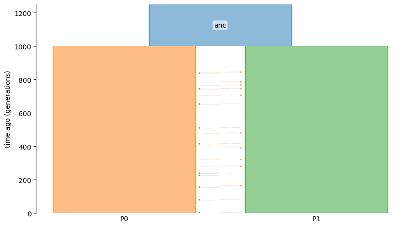

# ICR Tutorial 

This tutorial is an introduction to **ICR**, implemented as part of the
`demestats` package (specifically the `demestats.icr` modules). `demestats` also includes
other components (ICR/CCR curves, SFS, event trees, constraints, etc.), but this guide focuses
only on the ICR-based inference workflow.

The corresponding Jupyter notebook is available at `docs/tutorial_code/icr_tutorial.ipynb`.

# Instantaneous Coalescent Rate (ICR)

This tutorial shows how to compute instantaneous coalescence rate
(ICR) curves for several total sample sizes `k`, using both the exact solver
and the mean-field approximation.

- `demestats.icr.ICRCurve`: exact lineage-count CTMC. Accurate, but the state
  space grows quickly with `k`.
- `demestats.icr.ICRMeanFieldCurve`: deterministic mean-field approximation.
  Much faster for larger sample sizes.

`demestats` returns the coalescence hazard `c(t)` (also known as the ICR) together with the log-survival curve `log_s(t)`. 

## Overview

The `ICR` workflow inside `demestats` consists of:

1. Simulating (or loading) tree sequence data.
2. Define sample size, timepoints, and sampling configuration.
3. Building an `ICRCurve` or `ICRMeanFieldCurve` model from a `demes.Graph`.
4. Evaluating ICR log-likelihoods.
5. (Optionally) optimizing demographic parameters with constraints.

## Simulation

We will simulate a simple isolation-with-migration (IWM) model with two populations.
This uses `msprime` to build a demography and simulate ancestry/mutations.

```python
import msprime as msp
import demesdraw

demo = msp.Demography()
demo.add_population(initial_size=5000, name="anc")
demo.add_population(initial_size=5000, name="P0")
demo.add_population(initial_size=5000, name="P1")
demo.set_symmetric_migration_rate(populations=("P0", "P1"), rate=0.0001)
demo.add_population_split(time=1000, derived=["P0", "P1"], ancestral="anc")

g = demo.to_demes() # this demes.Graph g will be the input to demestats
demesdraw.tubes(g)
```



Simulate ancestry and mutations, with 10 diploids from each population:

```python
sample_size = 10
samples = {"P0": sample_size, "P1": sample_size}

anc = msp.sim_ancestry(
    samples=samples,
    demography=demo,
    recombination_rate=1e-8,
    sequence_length=1e8,
    random_seed=12,
)

ts = msp.sim_mutations(anc, rate=1e-8, random_seed=13)
```

For more details regarding simulation, please refer to [`msprime`](https://tskit.dev/msprime/docs/stable/demography.html).

## ICR: Exact and Mean-Field Curves

The `ICRCurve` and `ICRMeanFieldCurve` objects are the core components. First, construct the objects by passing in a `demes.Graph` and a sample size `k`.
Then, you can use that object to map a set of **time points** and **sampling configuration** to the expected ICR curve under a demographic model. 

We use a geometric time grid so the plot has more resolution in the recent past.
The lower endpoint is positive because `geomspace` does not include zero.

```python
import numpy as np
import jax.numpy as jnp
from demestats.icr import ICRCurve, ICRMeanFieldCurve

t = jnp.geomspace(1.0, 5_000.0, 250)
small_ks = [2, 4, 8]
all_ks = [2, 4, 8, 16, 32, 64]

def balanced_samples(k: int) -> dict[str, int]:
    return {"P0": k // 2, "P1": k - k // 2}

def iicr_values(curve_out) -> np.ndarray:
    return 1.0 / np.asarray(curve_out["c"])

icr_exact = ICRCurve(demo=g, k=2)
expected_exact = icr_exact(params={}, t=t, num_samples={"P0": 1, "P1": 1})
# you can also use a one liner ICRCurve(demo=g, k=2)(params={}, t=t, num_samples={"P0": 1, "P1": 1})

icr_meanfield = ICRMeanFieldCurve(demo=g, k=2)
expected_meanfield = icr_meanfield(params={}, t=t, num_samples={"P0": 2, "P1": 0})
```

Note that passing in `params={}` evaluates the expected ICR under the constructed demographic model `g`. The sampling configuration must add up to the sample size `k` used
to initialize the objects. Using k = 2, `{"P0": 1, "P1": 1}` represents a sampling configuration where one sample comes from population "P0" and the other comes from "P1". Similarly, `{"P0": 2, "P1": 0}` has two samples coming from population "P0".

when you inspect `icr_exact['c']` or `icr_exact['log_s']` you obtain the 
coalescence hazard `c(t)` and the log-survival `log_s(t)`. 

## Compute exact and mean-field curves

For `k = 2, 4, 8` we compute both the exact curve and the mean-field
approximation. For larger sample sizes, we only use the mean-field method.

```python
exact_curves = {}
mf_curves = {}

for k in small_ks:
    num_samples = balanced_samples(k)
    exact_curves[k] = ICRCurve(demo, k=k)(t=t, num_samples=num_samples, params={})
    mf_curves[k] = ICRMeanFieldCurve(demo, k=k)(t=t, num_samples=num_samples, params={})

for k in all_ks:
    if k not in mf_curves:
        mf_curves[k] = ICRMeanFieldCurve(demo, k=k)(
            t=t, num_samples=balanced_samples(k), params={}
        )
```

## Exact vs mean-field

The mean-field approximation is already quite close for modest sample sizes in
this example.

```python
for k in small_ks:
    exact_icr = icr_values(exact_curves[k])
    mf_icr = icr_values(mf_curves[k])
    rel_err = np.max(np.abs(mf_icr - exact_icr) / np.maximum(exact_icr, 1e-12))
    print(f"k={k:>2}: max relative error = {rel_err:.2%}")
```

```python
fig, ax = plt.subplots(figsize=(7.0, 4.0))
colors = plt.get_cmap("viridis")(np.linspace(0.15, 0.85, len(small_ks)))

for color, k in zip(colors, small_ks):
    ax.plot(t, icr_values(exact_curves[k]), color=color, lw=2, label=f"exact, k={k}")
    ax.plot(
        t,
        icr_values(mf_curves[k]),
        color=color,
        lw=2,
        linestyle="--",
        label=f"mean-field, k={k}",
    )

ax.axvline(split_time, color="0.6", linestyle=":", lw=1.5, label="split time")
ax.set_xscale("log")
ax.set_yscale("log")
ax.set_xlabel("time")
ax.set_ylabel("ICR(t)")
ax.set_title("ICR: exact vs mean-field")
ax.legend(frameon=False, ncol=2)
fig.tight_layout()
```

## Scaling to larger sample sizes

The exact method becomes expensive quickly as `k` grows, but the mean-field
approximation remains practical. The next plot extends the sample size up to
`k = 64`.

```python
fig, ax = plt.subplots(figsize=(7.0, 4.0))
colors = plt.get_cmap("plasma")(np.linspace(0.1, 0.9, len(all_ks)))

for color, k in zip(colors, all_ks):
    ax.plot(t, icr_values(mf_curves[k]), color=color, lw=2, label=f"k={k}")

ax.axvline(split_time, color="0.6", linestyle=":", lw=1.5, label="split time")
ax.set_xscale("log")
ax.set_yscale("log")
ax.set_xlabel("time")
ax.set_ylabel("ICR(t)")
ax.set_title("Mean-field ICR across sample sizes")
ax.legend(frameon=False, ncol=2)
fig.tight_layout()
```

As `k` increases, the total coalescence hazard rises because there are more
lineage pairs that can coalesce, so the ICR decreases. For exploratory work on
large samples, `ICRMeanFieldCurve` is usually the right starting point.

## Parameter overrides

To override and evaluate the model at specific parameter settings:

```python
from demestats.event_tree import EventTree

et = EventTree(g)

# Pick variables (by path) from the event tree.
v_split = et.variable_for(("demes", 0, "epochs", 0, "end_time"))
v_mig = et.variable_for(("migrations", 0, "rate"))

# All other non-selected parameters will use the values specified by model g.
# Construct new parameter setting
params = {
    v_split: 1200.0,
    v_mig: 2e-4,
}
```

The `params` dict can then be passed into `ICRCurve` and `ICRMeanFieldCurve`:

```python
icr_exact = ICRCurve(demo=g, k=2)
expected_exact = icr_exact(params=params, t=t, num_samples={"P0": 1, "P1": 1})

icr_meanfield = ICRMeanFieldCurve(demo=g, k=2)
expected_meanfield = icr_meanfield(params=params, t=t, num_samples={"P0": 2, "P1": 0})
```

## ICR log-likelihood

For likelihood-based inference, use the ICR log-likelihood helper from
`demestats.fit.fit_icr`.

To compute the ICR likelihood:

```python
from demestats.loglik.icr_loglik import icr_loglik

icr_ll = icr_loglik(
    time=t,
    sample_config=[1, 1],
    params=params,
    icr_call=icr_exact,
    deme_names=["P0", "P1"]
)
```

In order to use JAX's automatic differentiation, we cannot pass in dictionaries, so we must split a sample configuration `{"P0": 1, "P1": 1}` into two pieces,
an array of integers `sample_config` and an array of strings `deme_names` for the population names. For example, if one wants to use `{"P0": 0, "P1": 2}` then
 `sample_config` would be [0, 2] and `deme_names` would be ["P0", "P1"]. Note that `icr_call` requires an `ICRCurve` or `ICRMeanFieldCurve` object.

## Differentiable log-likelihood

Using JAX’s automatic differentiation capabilities via `jax.value_and_grad`, one can compute the gradient and log-likelihood. Here we
show an example of computing the gradient with respect to the rate of migration from P0 to P1 at 0.0002.

```python
import jax
param_key = frozenset({('migrations', 0, 'rate')})
sample_config=[0, 2]
deme_names = ["P0", "P1"]

@jax.value_and_grad
def ll_at(val):
    params = {param_key: val}
    icr_ll = compute_loglik(
        time=t,
        sample_config=sample_config,
        params=params,
        iicr_call=iicr_exact,
        deme_names=deme_names
    )
    return icr_ll

val = 0.0002
loglik_value, loglik_grad = ll_at(val)
```

## Parameterization and constraints

`demestats` automatically generates parameter constraints for a given model via
`EventTree` and `constraints_for`. This is part of the ICR workflow because it defines
the feasible parameter space for ICR-based optimization.

```python
from demestats.constr import EventTree, constraints_for

et = EventTree(g)
variables = et.variables

cons = constraints_for(et, *variables)
A_eq, b_eq = cons["eq"]
A_ineq, b_ineq = cons["ineq"]
```

Please refer to [`Model Constraints`](../momi3/model_constraints.md) to understand how to modify the constraints to one's needs.

## Putting it together (minimal optimization sketch)

A full optimizer is not shown here, but the typical flow is:

1. Create a vector for the parameters of interest (subset of `et.variables`).
2. Use `constraints_for` to get linear constraints.
3. Construct `ICRCurve` or `ICRMeanFieldCurve` object and obtain the expected ICR.
4. Evaluate ICR log-likelihood and optimize.

If you want a complete optimization example, use the notebook at
`docs/tutorial_code/icr_optimization.ipynb` and refer to [`icr Optimization`](icr_optimization.md).

## Where to go next

- For other `demestats` features (CCR curves, SFS, event trees, etc.), see the main
  documentation sections [`momi3`](../momi3/index.md) and [`CCR`](../ccr).
- For API details, see the generated module reference under [`API`](../api/index.rst).
