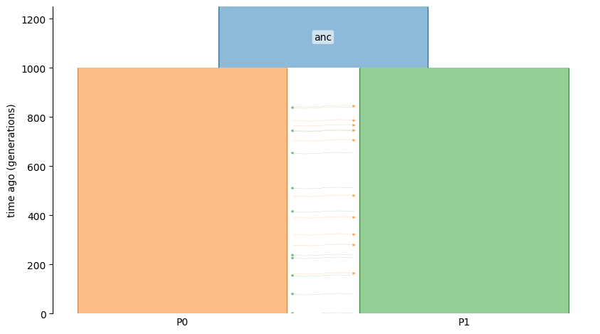

# momi3 Tutorial (within demestats)

This tutorial is a self-contained introduction to **momi3**, implemented as part of the
`demestats` package (specifically the `demestats.sfs` modules). `demestats` also includes
other components (IICR/CCR curves, event trees, constraints, etc.), but this guide focuses
only on the SFS-based inference workflow that people refer to as *momi3*.

The corresponding Jupyter notebook is available at `docs/tutorial_code/momi3_tutorial.ipynb`.

## Overview

The `momi3` workflow inside `demestats` consists of:

1. Simulating (or loading) genetic data.
2. Computing an allele-frequency spectrum (AFS).
3. Building an `ExpectedSFS` model from a `demes.Graph`.
4. Evaluating SFS log-likelihoods.
5. (Optionally) optimizing demographic parameters with constraints.

## Simulation

We will simulate a simple isolation-with-migration (IWM) model with two populations.
This uses `msprime` to build a demography and simulate ancestry/mutations.

```python
import msprime as msp
import demesdraw

demo = msp.Demography()
demo.add_population(initial_size=5000, name="anc")
demo.add_population(initial_size=5000, name="P0")
demo.add_population(initial_size=5000, name="P1")
demo.set_symmetric_migration_rate(populations=("P0", "P1"), rate=0.0001)
demo.add_population_split(time=1000, derived=["P0", "P1"], ancestral="anc")

g = demo.to_demes() # this demes.Graph g will be the input to demestats
demesdraw.tubes(g)
```



Simulate ancestry and mutations, with 10 diploids from each population:

```python
sample_size = 10
samples = {"P0": sample_size, "P1": sample_size}

anc = msp.sim_ancestry(
    samples=samples,
    demography=demo,
    recombination_rate=1e-8,
    sequence_length=1e8,
    random_seed=12,
)

ts = msp.sim_mutations(anc, rate=1e-8, random_seed=13)
```

Compute the AFS (allele-frequency spectrum):

```python
# afs_samples is based on the number of haploids
afs_samples = {"P0": sample_size * 2, "P1": sample_size * 2}
afs = ts.allele_frequency_spectrum(
    sample_sets=[ts.samples([1]), ts.samples([2])],
    span_normalise=False,
    polarised=True,
)
```

For more details regarding simulation, please refer to [`msprime`](https://tskit.dev/msprime/docs/stable/demography.html).

## ExpectedSFS (momi3 core)

The `ExpectedSFS` object is the core `momi3` component. It maps a `demes.Graph` and sample
configuration to the expected spectrum under a demographic model. We will use all of the simulated data, otherwise one can edit `afs_samples` to change the sample configuration.

```python
from demestats.sfs import ExpectedSFS

esfs = ExpectedSFS(g, num_samples=afs_samples)
expected = esfs(params={})
```

Note that passing in `params={}` evaluates the expected spectrum under the constructed demographic model `g`.

## Parameter overrides

To override and evaluate the model at specific parameter settings:

```python
from demestats.event_tree import EventTree

et = EventTree(g)

# Pick variables (by path) from the event tree.
v_split = et.variable_for(("demes", 0, "epochs", 0, "end_time"))
v_mig = et.variable_for(("migrations", 0, "rate"))

# All other non-selected parameters will use the values specified by model g.
# Construct new parameter setting
params = {
    v_split: 1200.0,
    v_mig: 2e-4,
}
```

The `params` dict can then be passed into `ExpectedSFS`:

```python
esfs = ExpectedSFS(g, num_samples={"P0": 20, "P1": 20})
expected = esfs(params=params)
```

## SFS log-likelihood

For likelihood-based inference, use the SFS log-likelihood helper from
`demestats.loglik.sfs_loglik`.

To compute the multionmial likelihood:

```python
from demestats.loglik.sfs_loglik import sfs_loglik

mult_ll = sfs_loglik(
    afs=afs,
    esfs=expected,
)
```
To use the Poisson likelihood, one must provide *both* the sequence length and mutation rate (theta):

```python
pois_ll = sfs_loglik(
    afs=afs,
    esfs=expected,
    sequence_length=1e8,
    theta=1e-8,
)
```

## Differentiable log-likelihood

Using JAX’s automatic differentiation capabilities via `jax.value_and_grad`, one can compute the gradient and log-likelihood given the expected and observed SFS. Here we
show an example of computing the gradient with respect to the rate of migration from P0 to P1 at 0.0002.

```python
import jax
param_key = frozenset({('migrations', 0, 'rate')})

@jax.value_and_grad
def ll_at(val):
    params = {param_key: val}
    esfs = esfs_obj(params)
    return sfs_loglik(afs, esfs, 1e8, 1e-8)

val = 0.0002
loglik_value, loglik_grad = ll_at(val)
# To compute gradient of multinomial likelihood, simply omit sequence_length and theta 
```

## Parameterization and constraints

`demestats` automatically generates parameter constraints for a given model via
`EventTree` and `constraints_for`. This is part of the momi3 workflow because it defines
the feasible parameter space for SFS-based optimization.

```python
from demestats.constr import EventTree, constraints_for

et = EventTree(g)
variables = et.variables

cons = constraints_for(et, *variables)
A_eq, b_eq = cons["eq"]
A_ineq, b_ineq = cons["ineq"]
```

Please refer to [`Model Constraints`](https://demestats.readthedocs.io/en/latest/model_constraints.html) to understand how to modify the constraints to one's needs.

## Putting it together (minimal optimization sketch)

A full optimizer is not shown here, but the typical flow is:

1. Create a vector for the parameters of interest (subset of `et.variables`).
2. Use `constraints_for` to get linear constraints.
3. Construct `ExpectedSFS` object and obtain the expected spectrum.
4. Evaluate SFS log-likelihood and optimize.

If you want a complete optimization example, use the notebook at
`docs/tutorial_code/momi3_optimization.ipynb` and refer to [`SFS Optimization`](https://demestats.readthedocs.io/en/latest/sfs_optimization.html).

## Where to go next

- To compute approximations of the full expected SFS, please see [``Random Projection``](https://demestats.readthedocs.io/en/latest/random_projection.html)
- For other `demestats` features (IICR/CCR curves, event trees, etc.), see the main
  documentation sections `IICR` and `CCR`.
- For API details, see the generated module reference under `API`.
