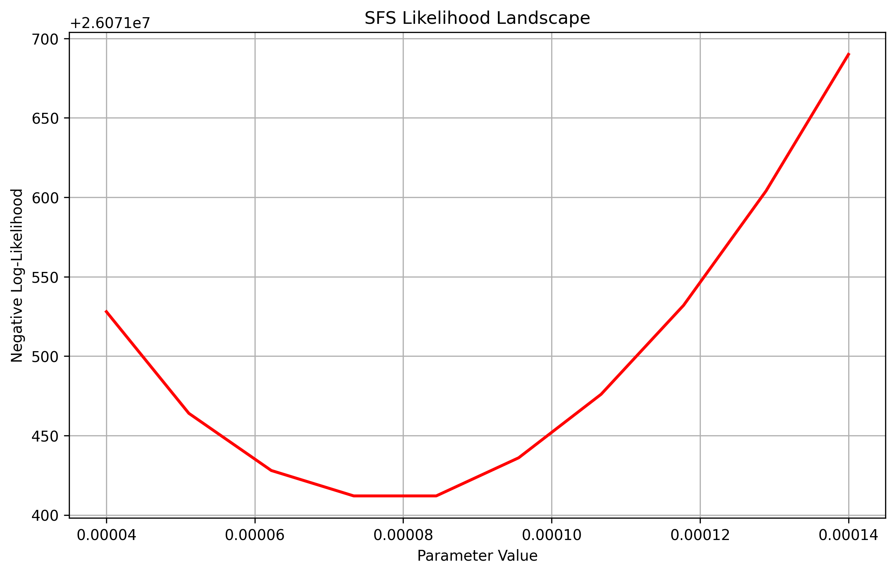
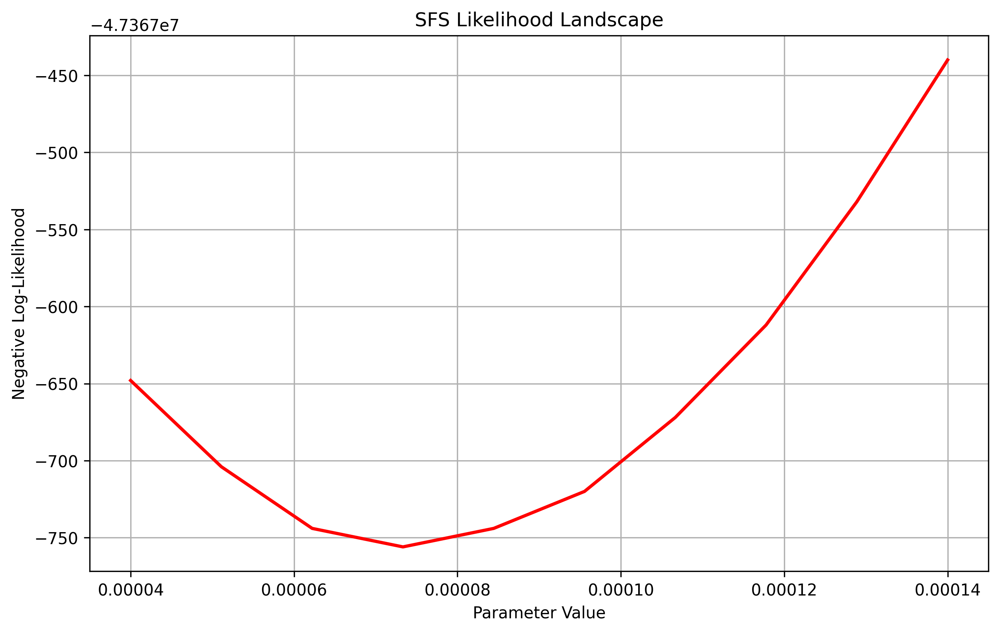
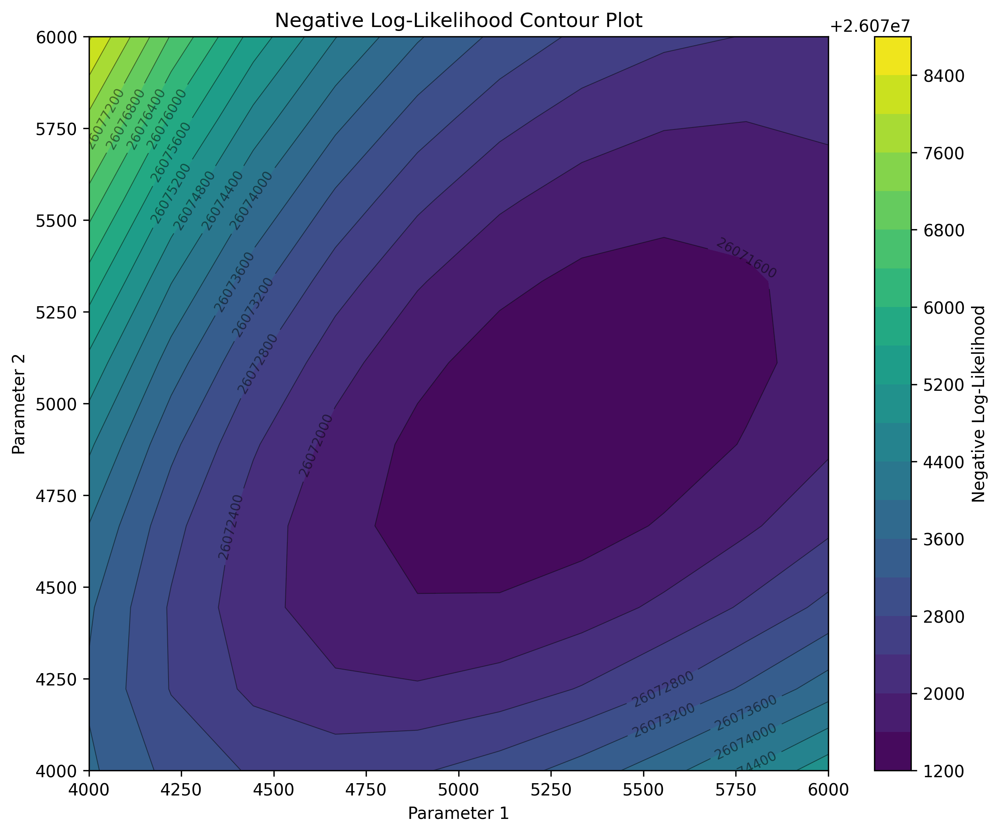

# Random projection

Random projection is a dimensionality reduction technique that projects high-dimensional data onto a lower-dimensional subspace using a random matrix. It's based on the Johnson-Lindenstrauss lemma, which states that distances between points are approximately preserved when projected to a sufficiently high dimensional random subspace.

The computational demands of evaluating the full expected site frequency spectrum (SFS) increase substantially with both sample size and model complexity. We implement random projection as an efficient, low-dimensional approximation method that preserves essential signals of the full SFS while dramatically reducing computational cost.

Please refer to [`momi3 Tutorial`](https://demestats.readthedocs.io/en/latest/momi3_tutorial.html) first before exploring random projections. All random projection capabilities are seamlessly integrated into `demestats`'s core architecture, accessible through the same functional interfaces demonstrated in the ``momi3 Tutorial`` documentation. Users can use these accelerated methods by simply providing an additional parameter to existing functions, maintaining the same intuitive workflow while gaining significant performance benefits.

Let us revisit the isolation-with-migration (IWM) model:

```python
import msprime as msp
import demesdraw

demo = msp.Demography()
demo.add_population(initial_size=5000, name="anc")
demo.add_population(initial_size=5000, name="P0")
demo.add_population(initial_size=5000, name="P1")
demo.set_symmetric_migration_rate(populations=("P0", "P1"), rate=0.0001)
demo.add_population_split(time=1000, derived=["P0", "P1"], ancestral="anc")
g = deme.to_demes()
demesdraw.tubes(g)

sample_size = 10 # simulate 10 diploids
samples = {"P0": sample_size, "P1": sample_size}
ts = msp.sim_mutations(
    msp.sim_ancestry(
        samples=samples, demography=demo,
        recombination_rate=1e-8, sequence_length=1e8, random_seed=12
    ),
    rate=1e-8, random_seed=13
)

# Each population will have 20 haploids
afs_samples = {"P0": sample_size * 2, "P1": sample_size * 2}
afs = ts.allele_frequency_spectrum(
    sample_sets=[ts.samples([1]), ts.samples([2])],
    span_normalise=False,
    polarised = True
)
```

The first step is to create the random projections using ``prepare_projection`` and one must provide the sample configuration (``afs_samples``), the observed frequency spectrum (``afs``), the number of projections to use and a seed for reproducibility.

```python
sequence_length = None
num_projections = 200
seed = 50 

proj_dict, einsum_str, input_arrays = prepare_projection(afs, afs_samples, sequence_length, num_projections, seed)
```

The function returns three components that collectively enable efficient likelihood computation via random projection: ``proj_dict`` contains the random projection vectors, ``einsum_str`` is a string specifying the Einstein summation for tensor operations, and ``input_arrays`` are preprocessed arrays that serve as inputs to the ``jax.numpy.einsum`` call, optimized for JAX's just-in-time compilation. Together, these components are used for computing the projected likelihood with optimal computational efficiency within JAX's differentiable programming framework.

To obtain a low dimensional representation of the SFS, we use ``tensor_prod`` which takes in a dictionary of the random projections and applies them to the full expected SFS evaluated at the specified parameter values in the ``paths`` variable. We follow the same setup in ``momi3 Tutorial`` documentation and create an ``ExpectedSFS`` object to apply ``tensor_prod``.

```python
paths = {frozenset({('demes', 0, 'epochs', 0, 'end_size'),
        ('demes', 0, 'epochs', 0, 'start_size')}):3000.,
    frozenset({('demes', 1, 'epochs', 0, 'end_size'),
        ('demes', 1, 'epochs', 0, 'start_size')}): 6000.,
    frozenset({('demes', 2, 'epochs', 0, 'end_size'),
        ('demes', 2, 'epochs', 0, 'start_size')}): 4000.}

esfs_obj = ExpectedSFS(g, num_samples=afs_samples)
lowdim_esfs = esfs_obj.tensor_prod(proj_dict, paths)
```

## Projected SFS log-likelihood

Each projection summarizes the full SFS with a single number, so the dimension of ``lowdim_esfs`` will match the number of projections used. One can also easily compute the likelihood using ``projection_sfs_loglik``. The likelihood follows similar principals as ``sfs_loglik`` where **BOTH** a sequence length and mutation rate (theta) must be provided to indicate Poisson likelihood.

To use the multionmial likelihood:

```python
from demestats.loglik.sfs_loglik import projection_sfs_loglik

mult_ll = projection_sfs_loglik(esfs_obj, params, proj_dict, einsum_str, input_arrays)
```

To use the Poisson likelihood, one must provide *both* the sequence length and mutation rate (theta):

```python
pois_ll = projection_sfs_loglik(esfs_obj, params, proj_dict, einsum_str, input_arrays, sequence_length=1e-8, theta=1e-8)
```

## Differentiable log-likelihood

Using JAX’s automatic differentiation capabilities via the `jax.value_and_grad`, one can compute the gradient and log-likelihood at specific parameter settings.

```python
loglik, grad = jax.value_and_grad(projection_sfs_loglik)(
    esfs_obj, 
    params, 
    proj_dict, 
    einsum_str, 
    input_arrays, 
    sequence_length=1e-8, 
    theta=1e-8
)
```

## Log-likelihood Visualization

To visualize the log-likelihood over one parameter using random projections, using ``plot_sfs_likelihood`` function we can pass in an argument for ``projection`` and ``num_projections``.

```python
import jax.numpy as jnp
from demestats.plotting_util import plot_sfs_contour

# override the parameter of interest
paths = {
    frozenset({("migrations", 0, "rate")}): 0.0001,
}

vec_values = jnp.linspace(0.00004, 0.00014, 10)
result = plot_sfs_likelihood(demo.to_demes(), paths, vec_values, afs, afs_samples, num_projections=200, seed=5, projection=True)
```



If one wanted to visualize the Poisson log-likelihood we just pass in sequence length and mutation rate.

```python
paths = {
frozenset({("migrations", 0, "rate")}): 0.0001,
}

vec_values = jnp.linspace(0.00004, 0.00014, 10)
sequence_length = 1e8
theta = 1e-8
result = plot_sfs_likelihood(demo.to_demes(), paths, vec_values, afs, afs_samples, num_projections=200, seed=5, projection=True, sequence_length=sequence_length, theta=theta)
```



Similarily if one wanted to plot contour plots for visualizing two variables at once, we use the same ``plot_sfs_contour`` and pass in an argument ``projection``.

```python
from demestats.plotting_util import plot_sfs_contour

paths = {
    frozenset({
        ("demes", 1, "epochs", 0, "end_size"),
        ("demes", 1, "epochs", 0, "start_size"),
    }): 4000.,
    frozenset({
        ("demes", 2, "epochs", 0, "end_size"),
        ("demes", 2, "epochs", 0, "start_size"),
    }): 4000.,
}

param1_vals = jnp.linspace(4000, 6000, 10)
param2_vals = jnp.linspace(4000, 6000, 10)

result = plot_sfs_contour(demo.to_demes(), paths, param1_vals, param2_vals, afs, afs_samples, projection=True, num_projections=200, seed=5)
```



These examples highlight that the projected SFS can capture similar signals as the full expected SFS, please refer to the preprint for further details.


