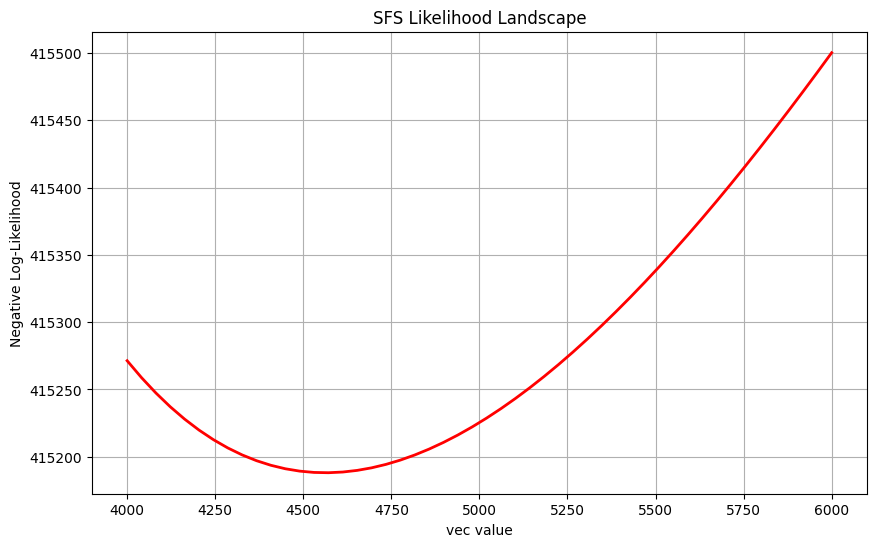
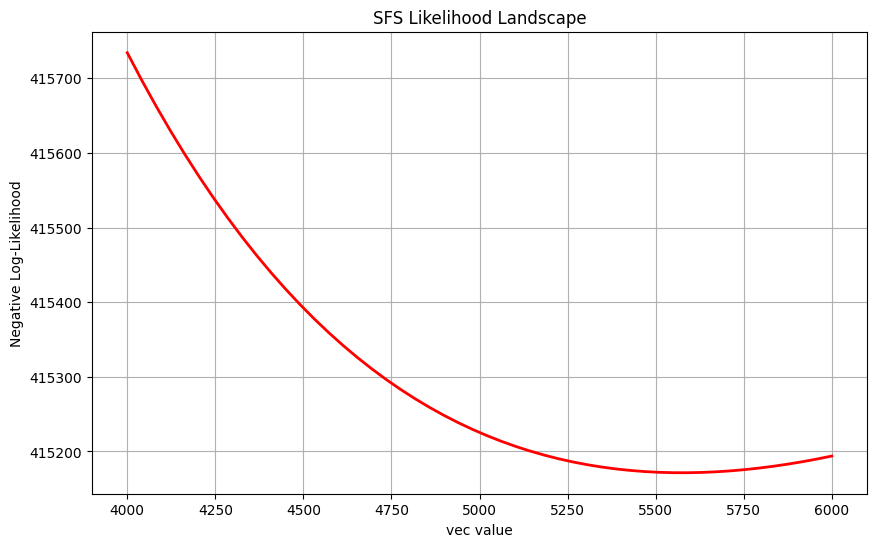
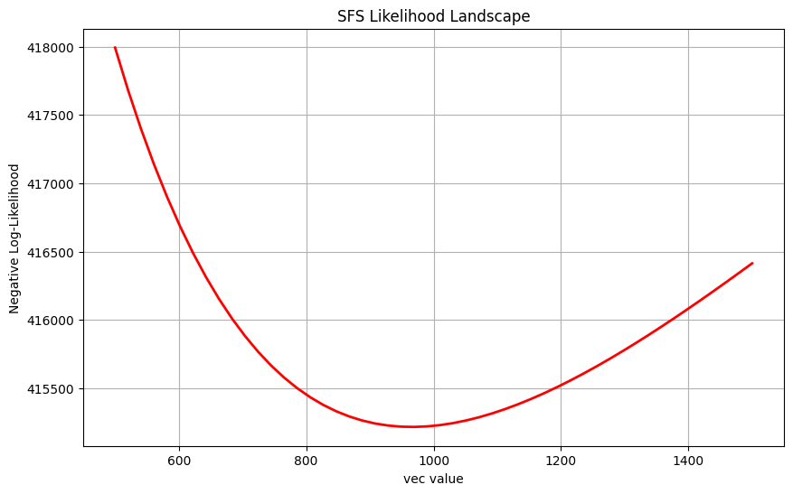
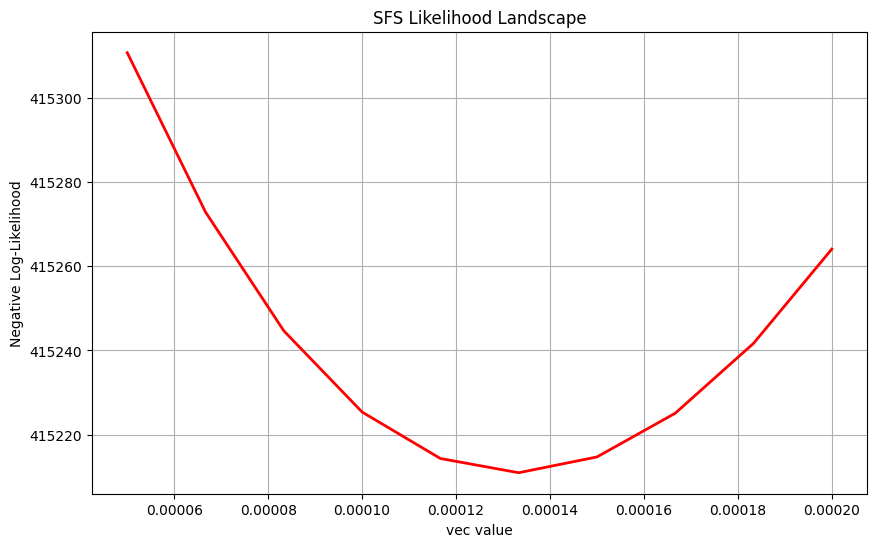
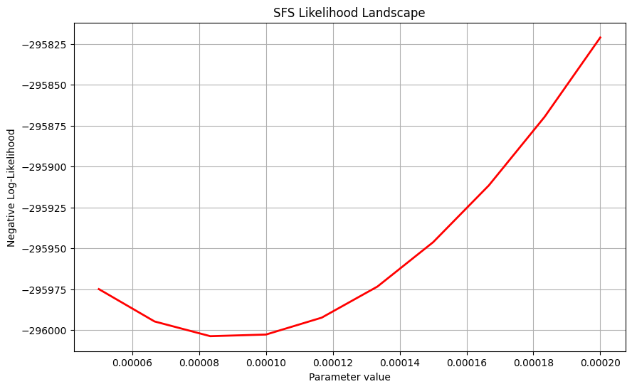
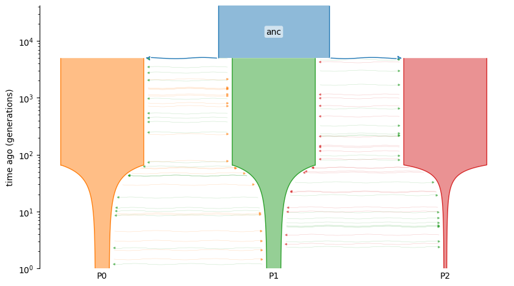

Tutorial
========

This tutorial demonstrates how to use the ``momi3`` module (part of the ``demesinfer`` package) to perform demographic inference on population models. 

In momi3, the main approach for demographic inference is based on the site frequency spectrum (SFS) of genetic data.

The corresponding Jupyter notebook for this tutorial is available at ``docs/momi3_tutorial.ipynb``.

We will walk through simulating a population structure, running inference using the SFS, and interpreting the results.  

Simulation
----------

We begin by simulating genetic data under a simple demographic model using the ``msprime`` and ``demes`` packages.

To get started, import the necessary packages:

.. code-block:: python

    import msprime as msp
    import demes
    import demesdraw

For simplicity, we consider a classic isolation-with-migration (IWM) scenario: two subpopulations (P0 and P1) that split from a common ancestor. All populations are assumed to have constant effective sizes of 5000, and after the split the subpopulations exchange migrants at a symmetric rate of 0.0001.

.. code-block:: python

    demo = msp.Demography()
    demo.add_population(initial_size=5000, name="anc")
    demo.add_population(initial_size=5000, name="P0")
    demo.add_population(initial_size=5000, name="P1")
    demo.set_symmetric_migration_rate(populations=("P0", "P1"), rate=0.0001)
    tmp = [f"P{i}" for i in range(2)]

We set the split time between the subpopulations and their ancestor to 1000 generations:

.. code-block:: python

    demo.add_population_split(time=1000, derived=tmp, ancestral="anc")

We can visualize the demographic model using ``demesdraw``:

.. code-block:: python

    g = demo.to_demes()
    demesdraw.tubes(g)

.. image:: images/demo.png
   :alt: Demographic model visualization
   :align: center

Next, we simulate the ancestry of 20 individuals sampled from the two subpopulations using ``msprime.sim_ancestry()``.  
We use a mutation and recombination rate of 1e-8 and a sequence length of 10 million base pairs, with fixed random seeds for reproducibility.

.. code-block:: python

    sample_size = 10
    samples = {f"P{i}": sample_size for i in range(2)}
    anc = msp.sim_ancestry(samples=samples, demography=demo,
                           recombination_rate=1e-8,
                           sequence_length=1e8,
                           random_seed=12)
    ts = msp.sim_mutations(anc, rate=1e-8, random_seed=13)

Lastly, we compute the allele frequency spectrum (AFS) from the simulated data:

.. code-block:: python

    afs_samples = {f"P{i}": sample_size*2 for i in range(2)}
    afs = ts.allele_frequency_spectrum(
        sample_sets=[ts.samples([1]), ts.samples([2])],
        span_normalise=False,
    )

For more details regarding the construction of demographic models using msprime.Demography(), please refer to: https://tskit.dev/msprime/docs/stable/demography.html

Demographic parameters in momi3
-------------------------------

A convenient feature of momi3 is its treatment of demographic model parameterization. It automatically translates a given demographic model (e.g., IWM, exponential growth, stepping stone, population split with migration) into the precise set of numerical constraints that satisfy model restrictions, such as those governing time intervals, population sizes, and admixture events. This eliminates the tedious and challenging manual derivation of constraints, making constrained optimization more accessible.

In the previous section, we simulated genetic data under an IWM model. We can now examine the full set of parameters associated with this model:

.. code-block:: python

    from demesinfer.constr import constraints_for, EventTree
    et = EventTree(g)
    et.variables

The output is a list of parameters, each entry representing one or more optimizable coordinates. If variables are tied by construction, they appear grouped inside a frozenset:

.. code-block:: python
    [frozenset({('demes', 0, 'epochs', 0, 'end_size'),
                ('demes', 0, 'epochs', 0, 'start_size')}),
    frozenset({('demes', 1, 'epochs', 0, 'end_size'),
                ('demes', 1, 'epochs', 0, 'start_size')}),
    frozenset({('demes', 2, 'epochs', 0, 'end_size'),
                ('demes', 2, 'epochs', 0, 'start_size')}),
    ('demes', 1, 'proportions', 0),
    ('demes', 2, 'proportions', 0),
    ('migrations', 0, 'rate'),
    ('migrations', 1, 'rate'),
    frozenset({('demes', 0, 'epochs', 0, 'end_time'),
                ('demes', 1, 'start_time'),
                ('demes', 2, 'start_time'),
                ('migrations', 0, 'start_time'),
                ('migrations', 1, 'start_time')}),
    frozenset({('demes', 1, 'epochs', 0, 'end_time'),
                ('demes', 2, 'epochs', 0, 'end_time'),
                ('migrations', 0, 'end_time'),
                ('migrations', 1, 'end_time')})]

Demes are indexed in the order they were added to the msprime.Demography() object. Here, demes 0, 1, and 2 correspond to populations anc, P0, and P1, respectively.

To reiterate and emphasize our ''Notation Section'', in this specific example, any parameters within the same ``frozenset`` object are treated as a single parameter, which implicitly constrains them all to be equal. The first three frozenset objects represent the constant population sizes for anc, P0, and P1, respectively. Because the population size is constant over the epoch, the start and end size are treated as a single parameter. 

('migrations', 0, 'rate') and ('migrations', 1, 'rate') are the respective assymetric migration parameters between populations P0 and P1. By default they will be treated as assymetric, one can edit the constraints to enforce symmetry and constrain the optimization to treat the two directions of migration as a single parameter. (See section below on editing constraints)

Proportion parameters like ('demes', 1, 'proportions', 0) and ('demes', 2, 'proportions', 0) describe admixture or pulse events when a population is formed from multiple ancestors. In this simple IWM model, there are no admixture events, so they are trivial in this context (effectively fixed and unused), but still appear for consistency with the general framework.

The last two frozenset objects constrain the timing of events. Following the construction of the model, the start times of subpopulation and migration events must always match the end time of the ancestral population. The last ``frozenset`` constrains the end time of subpopulations and the end time migrations to align together.

Demographic constraints in momi3
-------------------------------
Suppose you were interested in inferring 3 parameters - the ancestral population size, rate of migration from P0 to P1, and the time of divergence. To output the associated linear constraints:

.. code-block:: python

    constraints_for(et, *[frozenset({('demes', 0, 'epochs', 0, 'end_size'),
            ('demes', 0, 'epochs', 0, 'start_size')}), ('migrations', 0, 'rate'), frozenset({('demes', 0, 'epochs', 0, 'end_time'),
            ('demes', 1, 'start_time'),
            ('demes', 2, 'start_time'),
            ('migrations', 0, 'start_time'),
            ('migrations', 1, 'start_time')})])

The output of ``constraints_for`` is a dictionary with two keys:
- ``"eq"``: linear equality constraints ``(A_eq, b_eq)`` such that ``A_eq @ x = b_eq``.
- ``"ineq"``: linear inequality constraints ``(A_ineq, b_ineq)`` such that ``A_ineq @ x <= b_ineq``.

We called constraints_for with parameters ordered as:
- Column 0: ancestral population size
- Column 1: migration rate from P0 → P1
- Column 2: split time

So the output will be:

.. code-block:: python
    {
    'eq': (array([], shape=(0, 3), dtype=float64),
            array([], dtype=float64)),

    'ineq': (array([[-1., -0., -0.],
                    [-0., -1., -0.],
                    [ 0.,  1.,  0.],
                    [ 0.,  0., -1.]]),
            array([0., 0., 1., 0.]))
    }

**Interpretation of inequality constraints**:

- Row 0: ``-x[0] <= 0`` → ancestral population size ≥ 0
- Row 1: ``-x[1] <= 0`` → migration rate ≥ 0
- Row 2: ``x[1] <= 1`` → migration rate ≤ 1
- Row 3: ``-x[2] <= 0`` → split time ≥ 0

These constraints ensure biologically meaningful parameter ranges: population sizes and times must be nonnegative, and migration rates must lie within ``[0, 1]``.

In general, ``constraints_for`` automatically generates the linear restrictions required for optimization.

Modifying the constraints:
------------------------------------------
In addition to the constraints automatically derived from the demographic model, users may impose custom constraints to reflect specific biological assumptions or modeling choices.

A common example is the symmetry constraint on migration rates. This reflects the assumption that gene flow between two populations occurs at the same rate in both directions.

To enforce symmetric migration rates, we can add a new equality rule to the constraint matrices returned by constraints_for.

This time, let's say we want to infer 3 parameters - the ancestral population size and the symmetric migration rate between P0 and P1. We start by obtaining the default constraints:

.. code-block:: python
    from demesinfer.event_tree import EventTree
    from demesinfer.constr import constraints_for
    import numpy as np

    et = EventTree(g)

    constraint = constraints_for(et, *[
        frozenset({
            ("demes", 0, "epochs", 0, "end_size"),
            ("demes", 0, "epochs", 0, "start_size"),
        }),
        ("migrations", 0, "rate"),
        ("migrations", 1, "rate"),
    ])

With the code above, our constraint looks like this:

.. code-block:: python
    {'eq': (array([], shape=(0, 3), dtype=float64), array([], dtype=float64)),
    'ineq': (array([[-1., -0., -0.],
                    [-0., -1., -0.],
                    [ 0.,  1.,  0.],
                    [-0., -0., -1.],
                    [ 0.,  0.,  1.]]),
            array([0., 0., 1., 0., 1.]))
    }

As expected, there are no equality constraints, and the inequality constraints ensure nonnegative population size and migration rates bounded by 1.

Then, we can modify the constraint to enforce symmetry in migration rates:

.. code-block:: python

    # Extract existing constraints
    A_eq, b_eq = constraint["eq"]

    # Migration rates are at index 1 and 2
    i0rate = 1
    i1rate = 2

    # Build a new equality constraint: rate_0 - rate_1 = 0
    new_rule = np.zeros((1, A_eq.shape[1]))
    new_rule[0, i0rate] = 1.0
    new_rule[0, i1rate] = -1.0

    # Append to the existing constraint matrices
    A_eq = np.vstack([A_eq, new_rule])
    b_eq = np.concatenate([b_eq, [0.0]])

    # Update the constraint dictionary
    constraint["eq"] = (A_eq, b_eq)

Sure enough, the updated constraint now includes the symmetry condition:
.. code-block:: python
    {'eq': (array([[ 0.,  1., -1.]]), array([0.])),
    'ineq': (array([[-1., -0., -0.],
            [-0., -1., -0.],
            [ 0.,  1.,  0.],
            [-0., -0., -1.],
            [ 0.,  0.,  1.]]),
    array([0., 0., 1., 0., 1.]))
    }

Constraints can’t and shouldn't be directly removed, since they are derived from the demographic model structure.

However, frozenset parameters disappear when the model no longer forces equality. For example, if a population’s size is not constant across an epoch (e.g., exponential growth), its start_size and end_size become separate variables instead of a single tied frozenset.

To show that, let's define a new demographic model where population size changes over time.

.. code-block:: python
    demo = msp.Demography()
    demo.add_population(name="anc", initial_size=5000)
    demo.add_population(name="P0", initial_size=5000, growth_rate=0.002)
    demo.add_population(name="P1", initial_size=5000, growth_rate=0.002)
    demo.set_symmetric_migration_rate(populations=("P0", "P1"), rate=0.0001)
    tmp = [f"P{i}" for i in range(2)]
    demo.add_population_split(time=1000, derived=tmp, ancestral="anc")

This is a model where P0 and P1 grow exponentially from an initial size of 5000 at a rate of 0.002 per generation.

Rather than simulating, we directly examine parameters and constraints:

.. code-block:: python

    g = demo.to_demes()
    et = EventTree(g)
    et.variables

The output is:

.. code-block:: python
    [frozenset({('demes', 0, 'epochs', 0, 'end_size'),
            ('demes', 0, 'epochs', 0, 'start_size')}),
    ('demes', 1, 'epochs', 0, 'start_size'),
    ('demes', 1, 'epochs', 0, 'end_size'),
    ('demes', 2, 'epochs', 0, 'start_size'),
    ('demes', 2, 'epochs', 0, 'end_size'),
    ('demes', 1, 'proportions', 0),
    ('demes', 2, 'proportions', 0),
    ('migrations', 0, 'rate'),
    ('migrations', 1, 'rate'),
    frozenset({('demes', 0, 'epochs', 0, 'end_time'),
                ('demes', 1, 'start_time'),
                ('demes', 2, 'start_time'),
                ('migrations', 0, 'start_time'),
                ('migrations', 1, 'start_time')}),
    frozenset({('demes', 1, 'epochs', 0, 'end_time'),
                ('demes', 2, 'epochs', 0, 'end_time'),
                ('migrations', 0, 'end_time'),
                ('migrations', 1, 'end_time')})]

We can see that indeed, the population sizes for P0 and P1 are now treated as separate parameters (no longer in a frozenset), since they can differ due to exponential growth. The ancestral population size remains constant, so it is still grouped in a frozenset.

Correspondingly, the constraints will reflect this change. If you want to peek at the constraints, you can run:

.. code-block:: python

    constraints_for(et, *et.variables)

I would not show the full output here since it is too long, but you would see that the start and end sizes for P0 and P1 are now independent variables without equality constraints tying them together.

Inference using SFS-based methods in momi3
------------------------------------------
momi3 provides a likelihood function based on the expected site frequency spectrum (SFS) under a demographic model. This makes it possible to perform demographic inference by optimizing model parameters to maximize the likelihood of the observed SFS.

As a first step, let’s focus on a single parameter: the migration rate.

Assuming we already have simulated data and the demographic model from the previous section, we can set up the likelihood evaluation as follows:

.. code-block:: python

    param_key = ("migrations", 0, "rate")

    afs_samples = {"P0": 4, "P1": 4}
    ESFS = ExpectedSFS(g, num_samples=afs_samples)

    afs = np.array([0, 12, 7, 3, 0], dtype=float)

    def ll_at(val):
        params = {param_key: float(val)}
        esfs = np.asarray(ESFS(params))
        return float(sfs_loglik(afs, esfs))

    def grad_fd(val, h=1e-6):
        return (ll_at(val + h) - ll_at(val - h)) / (2.0 * h)

Here, ll_at(val) computes the log-likelihood of the observed SFS at a given migration rate, while grad_fd(val) estimates the derivative of the log-likelihood with respect to that parameter using a simple finite-difference approximation.

Evaluating both at a migration rate of 0.0001:

.. code-block:: python

    val = 0.0001
    print("Log-likelihood at rate =", val, "is", ll_at(val))
    print("Gradient at rate =", val, "is", grad_fd(val))

.. code-block:: python
    Log-likelihood at rate = 0.0001 is -409184.47044745344
    Gradient at rate = 0.0001 is -150385.37784130313

The values themselves don’t mean much in isolation, but they demonstrate how to call the likelihood and obtain its slope. This is the foundation for parameter inference: we can now pass these functions to a numerical optimizer such as scipy.optimize.minimize to estimate the migration rate.

In the following examples, we will infer three types of parameters: population sizes, split times, and migration rates.

**Note**: Inference with large sample sizes may be slow. Consider reducing the number of samples when running locally. For reference, in all the examples below, I used a sample size of 10 and ran them locally on a MacBook with an M2 chip. The runtime is usually around 10-15 seconds. Simply bumping this number to 20 results in a 5 minute runtime.

To visually inspect how the likelihood changes (and assess reliability), we define a helper function to plot the results:

.. code-block:: python

    from jax import vmap, lax
    from demesinfer.sfs import ExpectedSFS
    from demesinfer.loglik.sfs_loglik import sfs_loglik

    # Helper function to convert vector to dict
    def _vec_to_dict_jax(v: jnp.ndarray, keys: Sequence[Var]) -> Dict[Var, jnp.ndarray]:
        return {k: v[i] for i, k in enumerate(keys)}

    def plot_sfs_likelihood(demo, paths, vec_values,
                            afs, afs_samples,
                            theta=None, sequence_length=None):
        import matplotlib.pyplot as plt

        path_order: List[Var] = list(paths)
        esfs = ExpectedSFS(demo, num_samples=afs_samples)
        def evaluate_at_vec(vec):
            vec_array = jnp.atleast_1d(vec)
            params = _vec_to_dict_jax(vec_array, path_order)
            e1 = esfs(params)
            return -sfs_loglik(afs, e1, sequence_length, theta)

        results = lax.map(evaluate_at_vec, vec_values)

        plt.figure(figsize=(10, 6))
        plt.plot(vec_values, results, 'r-', linewidth=2)
        plt.xlabel("Parameter value")
        plt.ylabel("Negative Log-Likelihood")
        plt.title("SFS Likelihood Landscape")
        plt.grid(True)
        plt.show()

        return results

Estimating the ancestral population size
----------------------------------------

We first infer the size of the ancestral population ``anc``.  
With an initial guess of 4000, we evaluate the likelihood over a grid of values from 4000 to 6000:

.. code-block:: python

    import jax.numpy as jnp
    paths = {
        frozenset({
            ("demes", 0, "epochs", 0, "end_size"),
            ("demes", 0, "epochs", 0, "start_size"),
        }): 4000.,
    }
    vec_values = jnp.linspace(4000, 6000, 50)
    result = plot_sfs_likelihood(g, paths, vec_values, afs, afs_samples)

The negative log-likelihood is minimized around 4600, close to the true value of 5000.

Estimating the descendant population size
-----------------------------------------

Next, we infer the size of descendant population ``P0``.  
Again, starting from 4000, we search over values between 4000 and 6000:

.. code-block:: python

    import jax.numpy as jnp
    paths = {
        frozenset({
            ("demes", 1, "epochs", 0, "end_size"),
            ("demes", 1, "epochs", 0, "start_size"),
        }): 4000.,
    }
    vec_values = jnp.linspace(4000, 6000, 50)
    result = plot_sfs_likelihood(g, paths, vec_values, afs, afs_samples)

Here, the negative log-likelihood is minimized around 5500, close to the true value of 5000.

Estimating the split time
-------------------------

We then infer the split time between the ancestral population and its two descendants.  
This parameter is shared across multiple paths (two deme start times, one epoch end time, and two migration start times):

.. code-block:: python

    import jax.numpy as jnp
    paths = {
        frozenset({
            ("demes", 0, "epochs", 0, "end_time"),
            ("demes", 1, "start_time"),
            ("demes", 2, "start_time"),
            ("migrations", 0, "start_time"),
            ("migrations", 1, "start_time"),
        }): 4000.,
    }
    vec_values = jnp.linspace(500, 1500, 50)
    result = plot_sfs_likelihood(g, paths, vec_values, afs, afs_samples)

The negative log-likelihood is minimized around 1000, correctly recovering the split time.

Estimating the migration rate
-----------------------------

Finally, we infer the migration rate between the two descendant populations:

.. code-block:: python

    import jax.numpy as jnp
    paths = {
        ("migrations", 0, "rate"): 0.0001,
    }

    vec_values = jnp.linspace(0.00005, 0.0002, 10)
    result = plot_sfs_likelihood(g, paths, vec_values, afs, afs_samples)

Optimization with Poisson Likelihood
-----------------------------

The negative log-likelihood is minimized around 0.00013, close to the true value of 0.0001.

So far, we have used the multinomial likelihood, which is the default in sfs_loglik when we haven’t provided a mutation rate theta; it conditions on the total number of segregating sites. An alternative is the Poisson likelihood, which models the absolute counts of mutations given the mutation rate theta and the sequence length.

This requires passing mutation rate theta and sequence_length into the likelihood function. These parameters depend on the species and the research itself. The setup is the same as before, but now we explicitly provide these parameters. Let's try to optimize the migration rate again, but using the Poisson likelihood this time.

.. code-block:: python

    import jax.numpy as jnp

    # Suppose the true values used in simulation were:
    theta = 1.25e-8
    sequence_length = 1_000_000

    # Example: estimating the migration rate with the Poisson likelihood
    paths = {
        ("migrations", 0, "rate"): 0.0001,
    }

    vec_values = jnp.linspace(0.00005, 0.0002, 10)
    result = plot_sfs_likelihood(
        g, paths, vec_values,
        afs, afs_samples,
        theta=theta,
        sequence_length=sequence_length,
    )

Poisson likelihood is also optimized near the real value of migration rate 0.0001. Compared to the multinomial likelihood, the Poisson likelihood seems to be underestimate a bit, but it is actually more accurate. 

Population size change example
==========================================
We now consider a more complex demographic model that includes population size changes and migration rate changes over time.

.. code-block:: python

    import msprime as msp
    import demes
    import demesdraw
    import numpy as np

    # Create demography object
    demo = msp.Demography()

    # Add populations
    demo.add_population(initial_size=4000, name="anc")
    demo.add_population(initial_size=500, name="P0", growth_rate=-np.log(3000 / 500)/66)
    demo.add_population(initial_size=500, name="P1", growth_rate=-np.log(3000 / 500)/66)
    demo.add_population(initial_size=100, name="P2", growth_rate=-np.log(3000 / 100)/66)

    # Set initial migration rate
    demo.set_symmetric_migration_rate(populations=("P0", "P1"), rate=0.0001)
    demo.set_symmetric_migration_rate(populations=("P1", "P2"), rate=0.0001)

    # population size changes near 65–66 generations
    demo.add_population_parameters_change(
        time=65,
        initial_size=3000,  # Bottleneck: reduce to 1000 individuals
        population="P0",
        growth_rate=0
    )
    demo.add_population_parameters_change(
        time=65,
        initial_size=3000,  # Bottleneck: reduce to 1000 individuals
        population="P1",
        growth_rate=0
    )
    demo.add_population_parameters_change(
        time=66,
        initial_size=3000,  # Bottleneck: reduce to 1000 individuals
        population="P2",
        growth_rate=0
    )

    # Migration rate change changed to 0.001 AFTER 500 generation (going into the past)
    demo.add_migration_rate_change(
        time=66,
        rate=0.0005, 
        source="P0",
        dest="P1"
    )
    demo.add_migration_rate_change(
        time=66,
        rate=0.0005, 
        source="P1",
        dest="P0"
    )
    demo.add_migration_rate_change(
        time=66,
        rate=0.0005, 
        source="P1",
        dest="P2"
    )
    demo.add_migration_rate_change(
        time=66,
        rate=0.0005, 
        source="P2",
        dest="P1"
    )

    # THEN add the older events (population split at 1000)
    demo.add_population_split(time=5000, derived=["P0", "P1", "P2"], ancestral="anc")

    # Visualize the demography
    g = demo.to_demes()
    demesdraw.tubes(g, log_time=True)

**Note** The choice to use 65 (and 66) generations is intentional. In momi3, the event times that coincide exactly are treated as the same time identity and will be grouped into a single parameter (Check the notation section for more details). That’s useful when events truly share a time, but it can also merge parameters you’d prefer to optimize independently. Offsetting one set of events to 65 generations and the others to 66 keeps them as distinct time variables.

You can inspect the parameters/constraints and see the effect:

.. code-block:: python

    from demesinfer.constr import constraints_for, EventTree
    demo = g
    et = EventTree(demo)
    et.variables

Admixture example
==========================================

.. code-block:: python

    demo = msp.Demography()
    demo.add_population(initial_size=5000, name="anc")
    demo.add_population(initial_size=5000, name="P0")
    demo.add_population(initial_size=5000, name="P1")
    demo.set_symmetric_migration_rate(populations=("P0", "P1"), rate=0.0001)
    tmp = [f"P{i}" for i in range(2)]
    
    demography = msp.Demography()
    demography.add_population(name="P0", initial_size=5000)
    demography.add_population(name="P1", initial_size=5000)
    demography.add_population(name="ADMIX", initial_size=1000)
    demography.add_population(name="anc", initial_size=5000)
    demography.add_admixture(
        time=500, derived="ADMIX", ancestral=["P0", "P1"], proportions=[0.4, 0.6])
    demography.add_population_split(time=1000, derived=["P0", "P1"], ancestral="anc")
    g = demography.to_demes()
    demesdraw.tubes(g)

We modify the simple IWM example to have 4 populations, one ancestral population **anc** and three contemporary populations P0, P1, and ADMIX. We added an admixture event where ADMIX is derived from P0 and P1 500 generations ago, and then P0 and P1 merge into the ancestral population at 1000 generations. 

What an admixture event means is that at 500 generations going backwards in time, all the lineages that are in ADMIX will move to P0 with probability 0.4 and to P1 with probability 0.6. After 500 generations, the ADMIX population will be **inactive**. To see how this changes the parameters and constraints in the model observe:

.. code-block:: python
    from demesinfer.event_tree import EventTree
    from demesinfer.constr import constraints_for

    et = EventTree(g)

    # Show all parameter entries
    for v in et.variables:
        print(v)

The output looks like this:

.. code-block:: python
    frozenset({('demes', 0, 'epochs', 0, 'start_size'), ('demes', 0, 'epochs', 0, 'end_size')})
    frozenset({('demes', 1, 'epochs', 0, 'start_size'), ('demes', 1, 'epochs', 0, 'end_size')})
    frozenset({('demes', 2, 'epochs', 0, 'start_size'), ('demes', 2, 'epochs', 0, 'end_size')})
    frozenset({('demes', 3, 'epochs', 0, 'start_size'), ('demes', 3, 'epochs', 0, 'end_size')})
    ('demes', 1, 'proportions', 0)
    ('demes', 2, 'proportions', 0)
    ('demes', 3, 'proportions', 0)
    ('demes', 3, 'proportions', 1)
    frozenset({('demes', 2, 'start_time'), ('demes', 0, 'epochs', 0, 'end_time'), ('demes', 1, 'start_time')})
    ('demes', 1, 'epochs', 0, 'end_time')
    ('demes', 2, 'epochs', 0, 'end_time')
    ('demes', 3, 'epochs', 0, 'end_time')
    ('demes', 3, 'start_time')

In short, the admixture event enriches the parameter space by introducing admixture proportions, and the constraints enforce that they form a proper probability vector.